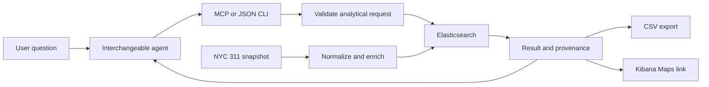

# NYC 311 build plan

Research date: 2026-10-06. Design baseline finalized after the interview and delegated decisions. Implementation now exists; this document retains the broader roadmap. See [runtime](runtime.md) and [verification status](acceptance.md) for current behavior and measured evidence.

User priorities: **reusable agent-neutral backend first, compelling demonstration second**. Robust research and evaluation are mandatory for both. Favor stable contracts over presentation shortcuts; test analytical correctness throughout implementation.

Local execution is required; capacity must scale with available hardware. Small datasets and fixtures are approved for constrained development machines. Operate Elasticsearch/Kibana on user-controlled hardware; build the analytical tools, integrations, and evaluation harness in-house. No mandatory managed service. Fully local model execution is an eventual goal; an existing external agent client is acceptable for the first solve. The initial design target is **one billion records**, subject to measured capacity and workload limits. Never silently reduce data coverage or label a subset run as million-record validation.

Scale evidence policy: distinguish fixture correctness, real-data Elasticsearch runs, generated-load runs, and modeled projections. Simulations guide capacity planning; capacity claims state the actual records, distribution, concurrency, hardware, and query workload tested. A billion-record projection is not a billion-record benchmark. The first solve requires real multi-million-record evidence; a demonstrated billion-record deployment is a later scale milestone, not a prerequisite for satisfying the original brief.

The [official Problem Book](https://drive.google.com/file/d/1jgVkhTP_0lUNdtPSH8PvHhlt5As826Tl/view), linked by [SCADS](https://ncsu-las.org/scads/), matches the supplied excerpt: Elasticsearch, Kibana Maps, summaries, CSV, and millions of NYC 311 records. Beyond-millions scaling is an additional user objective. Proposed benchmark tooling: [Rally custom tracks](https://esrally.readthedocs.io/en/stable/adding_tracks.html), preserving workload skew and recording reproducible hardware/load profiles; follow [Elastic sizing guidance](https://www.elastic.co/docs/deploy-manage/production-guidance/optimize-performance/size-shards) when interpreting capacity results.

## Architecture

Build a small Python analytical core using the Elasticsearch client, typed validation, and an MCP adapter. Start with an existing agent client. Keep prompts and provider SDKs outside the core; JSON requests must work without an LLM. Reuse Kibana for visualization. A bespoke chat frontend is a later option.

Use a constrained analytical specification compiled into Elasticsearch Query DSL. This supports filters, nested bucket aggregations, time comparisons, and proximity without asking each agent to rediscover field semantics. Expose compiled DSL for inspection. Arbitrary DSL and ES|QL can be later expert adapters, not requirements for the first implementation.

MCP supplies discoverable schemas and structured results; CLI supplies the same functions for agents with shell access. These are interoperability contracts, not a claim that every agent client supports every transport. [MCP tool specification](https://modelcontextprotocol.io/specification/2025-06-18/server/tools).

## Reuse decisions

| Existing approach | Decision |
| --- | --- |
| Elastic Agent Builder | Closest product baseline; study schema discovery, domain tools, and grounded answers. Optional agent host after deployment and subscription checks. |
| Elastic Labs search templates | Imitate constrained, parameterized analytical tools. |
| Elasticsearch and Kibana | Reuse query execution, aggregation, Maps, and saved dashboards. |
| Conversational BI projects | Borrow semantic definitions, inspectable queries, and result presentation; avoid importing a SQL-first stack. |
| Generic agent frameworks | Optional client adapters; none required by the analytical core. |

Evidence, implementation links, and maintenance caveats: [prior art](prior-art.md).

## Resource profiles

One tool contract and compiler across profiles. Select a profile explicitly; startup checks available memory, disk, CPU, and required services, then reports feasible limits. Changes to batch size, concurrency, and page size must preserve query meaning. Dataset reduction always requires an explicit selection and a new manifest.

| Profile | Execution | Evidence allowed |
| --- | --- | --- |
| Development | Small fixtures, independent arithmetic oracle, compiler and adapter tests; Elastic optional. | Contract/correctness evidence only. Test doubles cannot establish Elasticsearch, Kibana, or scale behavior. |
| Local integration | Self-hosted Elasticsearch/Kibana plus a bounded real NYC 311 subset; conservative concurrency. | Actual backend, map, and export compatibility at recorded size. |
| Full demonstration | Self-hosted deployment on capable hardware; at least two million real unique requests. | Original-brief acceptance after all functional and research gates pass. |
| Scale laboratory | Larger self-hosted machine or cluster on user-controlled hardware; generated load and repeated benchmarks. | Capacity only at executed sizes/topologies; larger estimates labeled projections. |

Stream ingestion and CSV export; never materialize the full corpus in application memory. Bound in-flight bulk requests and result buffers, checkpoint resumable jobs, and apply backpressure when queues fill. Stop safely on resource exhaustion. Choose shard/index layout from measurements; migrating to a larger topology is an explicit deployment operation, not a claim of automatic unlimited scaling.

For eventual offline operation, stage dataset files, packages, geographic boundaries, map assets, and model weights locally. First Maps tests can use locally loaded polygons without an external basemap. An offline-capability claim requires a network-disabled test after provisioning; merely hosting the application locally is insufficient.

No database replacement or universal analytics framework in the first solve. Keep dataset fields and metric definitions in a separate configuration/catalog so a future dataset adapter can reuse the core; cross-domain generality remains unproven until tested on another dataset.

## Data and analytical definitions

Use a frozen 2025 snapshot for the initial scale demonstration; extend to 2024–2025 for year-over-year comparisons. Official aggregate probes returned 3,655,041 and 7,111,811 rows respectively; uniqueness remains unverified. Acceptance requires **at least two million real unique service requests**, across all boroughs and categories. Start smaller for correctness. Preserve extraction date, dataset IDs, selected fields, filters, checksums, row counts, schema version, and exclusions in a manifest. Keep downloaded records and runs outside Git. [Measured source scope](data-research.md#sources-and-measured-scope).

Use explicit keyword, date, numeric, and geo mappings. Retain source IDs as strings. Normalize timestamps with a documented New York timezone policy; preserve original values and flag ambiguous or invalid times. Upsert by service-request ID. A completed extraction becomes an immutable index version; refreshed source data produces another version. Multi-page source extraction is not automatically an atomic source snapshot. Reconcile counts and record the extraction interval. [Data research](data-research.md).

| Term | Required meaning |
| --- | --- |
| Last month | Previous complete calendar month in America/New_York, anchored to the request's explicit `as_of`; never silently shift to available data. |
| Noise | Versioned category family expanded into exact source values; return the expansion. |
| Response time | Created-to-closed duration is **time to closure**, not first response or confirmed resolution. Require a closed status and valid, nonnegative duration; report inconsistent records separately. |
| Neighborhood | Versioned official NTA polygon enrichment. ZIP, borough, and community district retain their actual labels. |
| Worse or trending | Show current/baseline counts, comparable daily rates, absolute change, relative change, and sample sizes. Default is descriptive change, not significance or causality. |
| Agency comparison | Match complaint categories and created-date cohorts; show closed fraction and open backlog alongside closure durations. |

Treat a zero baseline as undefined percentage change. Include zero-count periods and categories; distinguish missing values from zero. Complaint counts reflect reported requests, not incidence or population-adjusted risk. Recent cohorts have incomplete closures; report this explicitly.

Reject period comparisons when either period lacks complete source coverage or extraction completeness is unknown. Unobserved days are not zero-count days. Partial-period analysis is outside the first contract; add it only with an explicit mode, verified observed coverage, appropriate denominators, and separate interpretation. Fixtures and subsets cannot support citywide trend claims.

## Milestones

| Stage | Build | Exit evidence |
| --- | --- | --- |
| 0 Feasibility | Establish the development profile; provision a self-hosted Elastic deployment when hardware permits and pin compatible Elasticsearch/Kibana versions. Load a bounded public sample, save one map, test dynamic category/date/proximity filters and CSV. Also test a small derived NTA metric layer. | Same request selection in query, CSV, and map; derived metric/color parity; reproducible map/dashboard export/import. Document map count exclusions. Offline checks alone do not close this gate. |
| 1 Data | Explicit mapping, resumable ingestion, deduplication, quality report, manifest, immutable index version. | Stable IDs; repeat load has no duplicates; counts reconcile; malformed dates/coordinates handled; rejected rows counted. |
| 2 Analytical core | Implement contract operations, compiler, query budgets, result provenance, category catalog, closure metrics, nested grouping, time comparisons. | Independent fixture oracle agrees with Elasticsearch; invalid and unsupported requests fail clearly. |
| 3 Exports and Maps | Stream row CSV through PIT pagination; export aggregate tables separately. Preconfigure dashboard and Maps layers; derive filters from the canonical request. | Export exceeds 10,000 rows without duplicates or silent truncation; map filtering matches the query; limits/exclusions visible. |
| 4 Agent access | MCP plus JSON CLI adapters over the same core. Agent instructions cover clarification, dataset coverage, and evidence-based summaries. | One live agent completes the end-to-end workflow; a second independent client uses the same contracts without core edits. |
| 5 Full brief | NTA enrichment, neighborhood trends, nested neighborhood/agency analysis, radius and polygon filters, frozen million-record dataset. | All required question families pass; evidence includes source/index count, hardware, latency, query trace, map, and CSV. |

Stage 0 is deliberately first: the exact external Kibana navigation mechanism must be proven on the chosen version. A URL that opens a map but loses a radius, date, or category filter fails. A point map of complaints also cannot substitute for a map of ranked neighborhood trends. [Elastic research and map spike](elastic-research.md).

Fixture, catalog, compiler, and resumable-ingestion work can proceed in the development profile while the live Stage 0 check awaits suitable hardware. Validate them against real Elasticsearch before claiming integration. Stage 3 depends on stable results; Stage 4 depends on the tool contract; Stage 5 establishes the original brief's scale claim. Larger capacity tests follow the evidence ladder below. Agent capability is assessed with real tool calls, not only scripted request replay.

## Query and output guarantees

All outputs use the same normalized request and immutable index version. Result IDs retain request, DSL, schema/catalog versions, absolute date bounds, units, completeness, and source manifest. CSV and Maps must not independently reinterpret the natural-language question.

For neighborhood trend maps, publish the bounded computed table into a derived-result index, keyed by `result_id` plus NTA. Join that result's metrics to pinned NTA polygons and style the selected change metric. Test the result filter, all eligible areas, zero/no-data handling, and tooltip values. Keep a base boundary layer for areas missing a join. This uses Kibana's documented term-join pattern; the actual result-index integration remains a Stage 0 spike. [Kibana term joins](https://www.elastic.co/docs/explore-analyze/visualize/maps/terms-join).

Use complete bounded group enumeration or paginated composite aggregation for comparative rankings. Do not rank all neighborhoods from a prematurely truncated top-N list. Elasticsearch terms counts and their subaggregations can be approximate; preserve error metadata or choose an exact strategy. Percentiles also need an explicit approximation label. [Terms aggregation](https://www.elastic.co/docs/reference/aggregations/search-aggregations-bucket-terms-aggregation), [percentiles](https://www.elastic.co/docs/reference/aggregations/search-aggregations-metrics-percentile-aggregation).

Fail analytical claims on shard failure, timeout, or incomplete computation. Preserve exact versus lower-bound hit counts and coverage warnings. Do not summarize a bounded preview as the whole dataset. [Search API](https://www.elastic.co/docs/api/doc/elasticsearch/operation/operation-search).

Proposed starting budgets: at most 100 preview rows (five by default), 5,000 total buckets per backend page, 50,000 accumulated groups per analysis, 30 seconds per analytical request, 10 tool calls per question. Account for nested buckets when choosing page size. Page exhaustive groups within the total budget; fail explicitly if incomplete, before ranking. These are configurable engineering limits, not measured capacity. Large exports run as cancellable jobs with progress, byte/row limits, and an explicit incomplete status. Every job closes PIT resources and removes partial artifacts on failure. Escape spreadsheet formula-like text in CSV and identify that transformation in export metadata.

The query executor reads only designated index versions. A separate artifact writer may create documents only in the derived-result index and create Kibana links; it cannot modify source records. Administrative commands provision assets and expire result artifacts. Enforce field/operator/index allowlists in the service; tool metadata alone does not enforce access. Treat source text as data. Local stdio is the first transport; remote deployment adds authentication, user-scoped result IDs, and expiring artifact access.

## Acceptance questions

Use a small deterministic fixture with independently calculated answers, then real indexed snapshots. Dates and coordinates below are explicit test inputs, not asserted data findings.

| Question or failure case | Required proof |
| --- | --- |
| Noise in Brooklyn last month | Correct month boundaries, category expansion, borough, result count, map, export. |
| Weekly sanitation complaints by borough | Nested grouping; complete weeks; zeros distinguishable from missing data. |
| Open rodent complaints within 1 km of a supplied coordinate | Exact distance constraint; invalid/missing coordinates accounted for. |
| Top complaint types this quarter versus last | Same category universe; comparable rates; zero baseline defined. |
| Which neighborhoods worsened for rodents? | Actual NTA enrichment; all eligible areas considered; counts, rates, minimum sample rule disclosed. |
| Compare agency closure times within those neighborhoods | Second tool call uses first result's NTA IDs and cohorts; median/mean plus closure coverage. |
| Export all matching records above 10,000 rows | Unique IDs; exact export count; no preview-only export; stable index version. |
| Missing geography or reversed dates | Explicit validation/quality result, no fabricated coordinates or duration. |
| Ambiguous place, category, or unsupported geography | Clarification or unsupported response; no silent substitution. |
| Data ends before requested period | Coverage warning; never relabel latest data as current. |
| Timeout, partial shards, cancelled export | No complete-result claim or apparently finished CSV. |
| Same request through two agent clients | Equivalent normalized request, numeric result, map filter, and export selection. |

Final demonstration requires all specified behaviors, at least two million indexed real unique records, and saved traces. Measure query-only and agent-inclusive latency separately; report cold and warm runs, resource configuration, and percentile measurements. Choose a usable latency target after the first benchmark; do not invent a throughput promise.

## Research and scaling gates

The first research deliverable is reproducible engineering evidence. Comparative human/agent studies and publication are later work.

1. **Deterministic correctness:** independent expected results for all question families and boundary cases. Exact agreement for IDs/counts/filter membership; predeclared tolerances for floating-point and approximate metrics. Cover date/DST boundaries, zeros, missing geometry, invalid durations, nested filters, pagination, and failures. All mandatory cases pass; expected answers must not be generated by the compiler being tested.
2. **Agent evaluation:** author a development set and at least 40 held-out questions covering the supported families, ambiguity, coverage gaps, and unsupported requests. Freeze questions, scoring rules, catalog, and software before the held-out run. Run each question three times with fresh sessions. Score intent/spec correctness, numeric answer, needed clarification, evidence, map/export correspondence, and unsupported claims. Record failures rather than selecting the best attempt. Initial release target: at least 90% end-to-end pass rate across question-run pairs, with every mandatory family represented and passing in the canonical suite. Report variability by question; three repetitions are not three independent held-out examples. Any fabricated numeric evidence or silently incomplete output blocks release until fixed and re-evaluated.
3. **Agent interchangeability:** replay contracts through CLI and MCP; then run a representative common subset through two independent live agent clients without editing the analytical core. Report per-client results. This establishes portability to those clients, not universal compatibility or a model ranking.
4. **Scale experiments:** use reproducible generated workloads at increasing sizes, for example 1M, 10M, 100M, and ultimately 1B records where resources permit. Preserve realistic skew, cardinality, missingness, temporal distribution, and geographic hotspots; duplicated rows alone are insufficient. Vary query complexity, concurrent requests, ingestion, and export activity. Include restart, resource exhaustion, cancellation, and checkpoint recovery. Small resource-limited experiments and mathematical simulations supplement larger physical runs.
5. **Evidence package:** retain dataset/seed/version, query mix, hardware/topology, software versions, configuration, run count, cold/warm behavior, latency distribution, throughput, error rate, and resource usage. Report sample counts and uncertainty; a small repeated test is not a population-wide accuracy claim. Record agent tokens/cost only when available. Publish measured results and projected capacity separately, with explicit untested limits.

Held-out results are for evaluation; after using their failures to change the system, retain them as regression tests and create a fresh holdout for the next generalization claim. Set performance pass thresholds from a development benchmark before final evaluation; do not choose them after seeing final results. Hardware availability may defer the full demonstration, but does not convert simulated millions into a completed real-data solve.

## First implementation scope

Proposed files: `src/analytics311/` for ingestion, contracts, query compilation, execution, exports, map integration, CLI, and MCP; `config/` for mappings/catalog; `kibana/` for verified saved objects; `tests/fixtures/` for small public or synthetic correctness inputs; ignored `data/` and `runs/` for large artifacts.

Resolve deployment availability, tested Elastic versions, retained time window, neighborhood boundary vintage, and map-link feasibility during Stage 0. A local environment probe found no Docker command; do not assume containers are already available. No installation, data bulk download, provider integration, or deployment occurred during this planning pass.
