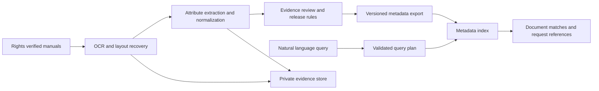

# Project 3 Semantic Discovery from Technical Documentation

Vintage Overseas Power Tools (VOPT): an implemented offline pipeline for scanned-manual extraction, evidence review, controlled metadata release, and natural-language document discovery. Originals and OCR stay in a private workspace; discovery receives only a validated metadata snapshot.

Start with the [operating guide](RUNBOOK.md) and [measured acceptance status](reports/acceptance-status.md). See [offline packaging](docs/offline.md), [implementation contracts](docs/implementation-contract.md), [independent audit](reports/independent-core-audit.md), [corpus evidence](data/corpus-research.md), [roadmap](ROADMAP.md), and [A1–A12 completion criteria](ACCEPTANCE.md). Engineering functionality is implemented; broad extraction reliability, untouched evaluation, and independent human validation remain completion gates.

Requirements come from the Project 3 description supplied in this chat. The research alternatives below were checked on 6 October 2026; they are distinguished from the implemented choices here.

## Implemented system

- Python CLI plus two loopback-only browser modes: private review and read-only discovery.
- PyMuPDF page geometry/native text; bundled RapidOCR ONNX models for image pages, including orientation attempts. Per-page checkpoints and bounded retry preserve partial failures. Re-extract cached pages without repeating OCR.
- Line-rule baseline and layout-aware rules; model/header scope, canonical units, ranges, tolerances, rating and operating qualifiers, explicit ambiguity. Thirteen numeric attributes are supported; arbitrary technical categories and foreign-language extraction remain gaps.
- Append-only review: original evidence retained, extraction fingerprint and review-event concurrency checks, human/agent/fixture provenance. Human decisions required by default for export.
- Strict coverage-only or value-bearing bundles; atomic SQLite imports, sequence replay prevention, revocation-safe rollback, and full index replacement. Deleted FTS terms are checked in shadow storage and database bytes.
- Inspectable Boolean query plans; exact identifiers, unit conversions, numeric bounds, supported negation, same-model/variant enforcement. BM25 is the default; ontology-normalized TF-IDF is a measured comparator, not a pretrained embedding model. Authored development cases have not established an advantage for the latter.
- Source-free discovery installation, hash-pinned offline wheels, model/license inventory, guarded cold-start tests, and a Windows portable-runtime assembler.

Five admitted historical manuals cover 616 scanned pages; four contain powered equipment and one is a hand-tool control. Two additional manuals remain excluded over mixed OEM-content rights. All are development material, not untouched test data. Agent-inspected source leads are not human gold.

Development results: 610 pages processed, six explicit failures; 21 raw candidates and 14 agent-reviewed observations. Selected field matches: layout rules 13/17, line baseline 4/17. Actual reviewed values retrieval: macro recall@10 0.9118 on 17 positive authored queries. Full-scope correctness and unseen-family accuracy are separate, unresolved claims. [Extraction](reports/extraction-development.md), [retrieval](reports/retrieval-development.md), [browser verification](reports/interface-verification.md).

```powershell
uv venv --python 3.12 .venv
uv pip install --python .venv/Scripts/python.exe -e '.[extraction,test]'
.venv/Scripts/python.exe -m vopt doctor
.venv/Scripts/python.exe -m pytest -q
```

These preparation commands require an available installer and dependencies. Deployment uses the separately packaged local wheels/runtime. No external API or model download fallback runs inside the application.

## Agreed scope

The user accepted discovery as the primary outcome, separate coverage-only and approved-value profiles, narrower attributes before compromising reuse rights, human-reviewed evaluation with independent review of ambiguous cases, and provisional workflows if the mapped use cases remain unavailable. Direct specification answers are deferred.

**The complete solution must run offline.** OCR, extraction, query interpretation, and search use local dependencies and models; no external API comparison is planned. Package required assets and test clean-target installation and cold-start operation with networking disabled. The deliverable is a robust, comprehensive solution for the problem-set PDF, supported by a reproducible implementation, representative evaluation, and operational failure tests. Corpus and attribute counts follow the coverage required for those claims; a tiny demonstration is insufficient.

## Scope and central decision

The project has two research questions: can scanned manuals yield reliable technical attributes, and can those attributes support useful natural-language document discovery? The supplied description also mentions an existing unclassified use-case mapping. Seek it, but proceed with explicitly provisional vocabulary and user journeys if it remains unavailable.

**Metadata-only does not necessarily mean value-free.** Define the release policy separately from the extraction schema:

| Discovery mode | Example request | Metadata required |
| --- | --- | --- |
| Document existence and coverage | Which manuals cover engine horsepower? | Released document identity and verified attribute coverage |
| Value-constrained discovery | Find tools with rated engine output above 3 hp | Released values, units, rating qualifiers, and model associations |
| Direct specification answer | What is model X's rated horsepower? | An approved, attributable value with revision and conflict handling |

Coverage discovery and value-constrained discovery use separate release profiles. Direct answers are deferred. A coverage-only catalog cannot answer numeric thresholds. It must report that limitation rather than silently discard the constraint. Filtering or ranking by an unreleased value would also cross the boundary.

## Architecture



**Extraction workspace:** originals, page images, OCR, table structure, candidate assertions, and page/region evidence. Bind every assertion to its model, variant, and document revision. Preserve conflicts and per-page processing status. Ingestion is resumable and idempotent. Evidence review preserves original candidates; changed sources or processing versions invalidate affected review/release decisions until reconciled.

**Release boundary:** a field allowlist exports only approved identity, coverage, and optionally specification values. Keep raw OCR, quotations, page crops, unrestricted summaries, and content embeddings upstream. Treat titles and identifiers as release-controlled fields too. Version and validate bundles; import atomically. Rollback must honor the latest imported release policy and withdrawals or fail closed. Whole-catalog replacement is sufficient when withdrawal, changed revisions, and profile downgrades remove stale entries from every index and cache.

**Discovery workspace:** a separate process and database containing only the export. It has no source-directory access or document-fetching credentials. Explanations cite matching catalog fields. A result supplies a document/version reference for a later request workflow; obtaining the document remains a separate action.

## Extraction approach

The implementation currently uses PyMuPDF and RapidOCR with explicit geometry/domain rules. The alternatives below remain research candidates; they are not installed or measured by the current comparison.

| Candidate | Documented capability | Proposed role |
| --- | --- | --- |
| [Docling](https://github.com/docling-project/docling) | Local PDF processing, OCR, layout and table support | First integrated extraction candidate |
| [OCRmyPDF with Tesseract](https://ocrmypdf.readthedocs.io/en/latest/introduction.html) | Adds OCR text layers and supports deskew; reading order and poor scans remain limitations | Simple OCR baseline plus explicit attribute rules |
| [PaddleOCR PP StructureV3](https://www.paddleocr.ai/main/en/version3.x/pipeline_usage/PP-StructureV3.html) | Layout detection, OCR, table recognition, reading-order recovery | Compare on difficult tables if the first candidate fails |

Docling represents tables, hierarchy, bounding boxes, and provenance; these support evidence review but do not themselves establish correct domain attributes. [Document representation](https://docling-project.github.io/docling/concepts/docling_document/). Its code is MIT-licensed; individual model licenses require separate checking. [License statement](https://github.com/docling-project/docling#license).

Proposed sequence: detect scan/text pages; recover orientation and layout; retain tables and headers; identify model scope; extract candidate attributes; validate units and qualifiers; review ambiguity; export approved records. Test image-only pages explicitly so existing PDF text cannot masquerade as successful OCR.

Start with vocabulary aliases and table-aware rules. Add a constrained language or vision model only if measured failures justify it; require source evidence for each candidate and allow abstention. Do not substitute general model knowledge for a manual's specification.

## Metadata contract

Store one assertion per model, variant, attribute, qualifier, and source revision, rather than one flat specification row per manual.

| Record | Minimum fields | Location |
| --- | --- | --- |
| Document | Stable ID, revision, manufacturer/model references, category, language | Released if approved |
| Coverage | Attribute identifier, evidence-backed presence, review status | Coverage export |
| Specification | Attribute, typed value or range, unit, rating/operating qualifier, model/variant, assertion ID | Optional value export |
| Evidence | File hash, page, bounding box/table cell, original text, extraction method/version | Private |
| Quality and release | Candidate/reviewed/conflicting status, review record, policy/export version | Private; selected status fields may be released |
| Corpus rights | Source URL, rights statement URL, scope, attribution, verification date | Corpus registry |

Initial attribute candidates: power source, rated voltage, electrical input power, mechanical output power, rotational speed, capacity, dimensions, and weight. Corpus coverage determines the final selection. Engine output and motor output remain distinct where relevant; input watts must not become output horsepower through a unit conversion. Preserve original units, ranges, rated/peak labels, and unresolved ambiguities.

An unobserved attribute means **unknown**, not zero or absent. Attribute mentions in generic safety prose do not establish a specification for the target model. OCR confidence and extraction scores are diagnostic signals, not calibrated probabilities of truth.

## Search design

Start with SQLite: structured tables for exact constraints, and FTS5/BM25 over approved metadata labels and descriptions. SQLite documents the ranking support in its [FTS5 reference](https://sqlite.org/fts5.html#the_bm25_function).

Natural language becomes an inspectable query plan: category, model, attribute, operator, value, unit, and rating qualifier. An alias vocabulary can map ordinary phrases to schema fields; unsupported or ambiguous phrases prompt clarification. Apply numeric and model constraints exactly before ranking. This is a bounded language interface, not an unrestricted natural-language claim.

Compare a local semantic candidate against the lexical baseline during development/validation; adoption in the final system depends on measured benefit. Sentence Transformers provides a query/document embedding approach; that capability does not demonstrate improvement on this corpus. [Semantic search documentation](https://www.sbert.net/examples/sentence_transformer/applications/semantic-search/README.html). Any embedding/query model must run locally with prepackaged assets and receive the schema and released metadata only.

## Corpus and evaluation

The [corpus assessment](CORPUS.md) identifies a public-domain historical appliance scan and conditional alternatives. A representative rights-qualified corpus with the target attributes remains unresolved; tools and/or appliances are within scope. Historical sewing-machine material can test scan handling but does not establish horsepower coverage. Artificially degraded pages are useful stress tests, reported separately from original scans.

Begin with a small feasibility pilot, then expand until the [coverage and evidence gates](ACCEPTANCE.md) are satisfied. No fixed tiny corpus or attribute cap defines completion. Include authentic difficult scans, varied layouts, multi-model specifications, revisions, and technical qualifiers. Freeze final manual families and independent queries before tuning; group duplicate editions and derivatives. Independently review a random annotation sample as well as difficult cases. Synthetic failures supplement authentic data and remain separately reported.

| Experiment | Evidence to report |
| --- | --- |
| Extraction | Precision/recall for complete model-attribute-value-unit-qualifier associations; evidence localization; errors by scan and layout type |
| Search using human-verified metadata | Recall/ranking, query interpretation, hard-constraint correctness, clarification and abstention, broken down by query type |
| Search using extracted metadata | Same queries and metrics; isolates the downstream cost of extraction errors |
| Coverage versus value export | Which user needs each profile can satisfy; unsupported requests reported separately |
| Metadata boundary | Search runs with originals/OCR inaccessible; source-only sentinel phrases cannot affect matches, explanations, or embeddings |
| Offline operation and lifecycle | Clean-target installation/cold starts, interrupted jobs, invalid imports, withdrawal, downgrade, rollback; no network or private-source dependency in discovery |

After the pilot, freeze numerical targets, per-slice evidence requirements, queries, labels, and configuration before final evaluation. Measure raw automatic, reviewed, and reference-metadata conditions separately. Non-negotiable checks include traceable evidence, no network dependency, no private-source access during discovery, and no silently relaxed constraints. Compare review/processing effort with a manual baseline before claiming labor savings. Preserve final-test failures; fixes alone are regression evidence, not renewed untouched-test accuracy.

Relevance labels should distinguish what the original document contains from what the release profile exposes. This reveals both extraction loss and information deliberately omitted from the catalog. Missing published evidence cannot support a claim that the manual lacks the information.

## Next decisions and milestones

1. Seek the referenced mapping; use provisional workflows if unavailable. Select corpus-supported attributes for the agreed coverage and value profiles.
2. Assemble a small corpus manifest with exact rights evidence; annotate representative pages and define the attribute vocabulary.
3. Compare a simple extraction baseline with a layout-aware approach on the same labeled pages; choose using complete-assertion accuracy and review effort.
4. Compare lexical and local semantic discovery on development/validation questions; preserve exact constraints. Freeze choices before using the final untouched test set.
5. Complete evidence review, release/revision/withdrawal, offline packaging, and recovery workflows. Pass the comprehensive acceptance protocol before writing final results for the solution PDF.

Implementation, publication, and performance claims follow those decisions. This research does not establish suitability for classified deployment.
