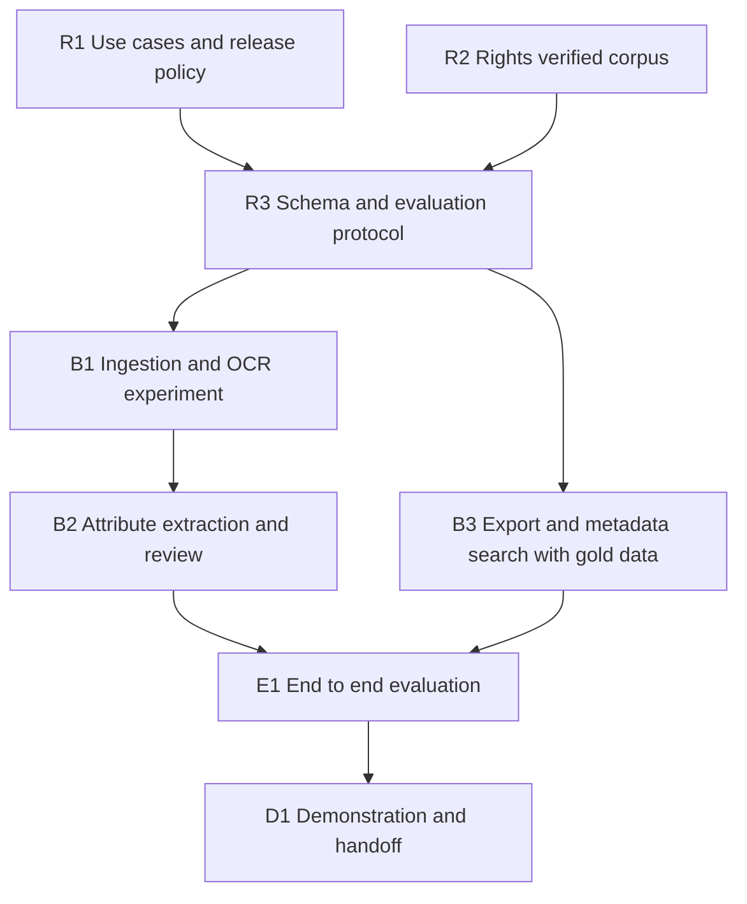

# VOPT research and implementation roadmap

**Current stage: implementation and development evaluation.** The offline pipeline, review/discovery interfaces, lifecycle controls, and packaging exist in `vopt/` and `scripts/`. This roadmap retains the original acceptance gates; working software does not by itself pass the corpus/generalization gates. Use [RUNBOOK.md](RUNBOOK.md) for executable workflows.

## Build status and remaining sequence

| Work | Implemented evidence | Remaining gate / roadblock |
| --- | --- | --- |
| Corpus | Five admitted scans, pinned manifest, rights snapshots, family grouping; two candidates excluded | Historical government machinery is narrow. Add genuine handheld/appliance and poor-scan families; resolve rights before admission. |
| Ingestion / extraction | Resumable pages, local OCR, baseline/layout methods, source snapshots, native-process deadlines/recovery, re-extraction, versioned source audit | Broaden difficult tables, component scope, discrete alternatives and categorical specifications. Rule precision cannot be inferred from matching selected leads. Add hard memory limits and parent-death cleanup. |
| Review / release | Source page UI, corrections, stale/concurrent decision rejection, strict profiles | Independent human annotation and timed workflow study; authenticated roles are outside the local research deployment. |
| Catalog / search | Atomic import/rollback, revocation/index purge, both retrieval methods, compositional constraints | Independently authored paraphrases and final-family relevance labels; whole-catalog scans bound measured scale. |
| Offline / packaging | Local wheel/model/license inventory, fresh environment proofs, portable runtimes with bundled Python, exact-source verification | Actual target OS isolation and source/license qualification before redistributing binaries. See exact artifacts in reports/build-verification.json. |
| Evaluation / publication | Development scripts, regression suite, source leads, synthetic scale, independent defect audit | Freeze final protocol and obtain untouched evidence; then write the verified PDF chapter. |

Remaining execution order: (1) acquire and quarantine new families; (2) independent annotation/adjudication; (3) resolve remaining extraction gaps using development-only evidence; (4) freeze configuration and evaluate untouched families once; (5) target-machine offline/resource qualification; (6) source/license qualification and publication package. Development source records and agent review decisions are frozen; no current artifact substitutes for missing human/final-test evidence.

## Intended result

A user asks a natural-language question, sees relevant document identities and metadata-based explanations, and obtains a document request reference. OCR and extraction happen beforehand in a separate workspace. Search remains functional when the original manuals and OCR are unavailable.

Agreed direction: discovery is primary; implement separate coverage-only and approved-value profiles. Direct specification answers are deferred. The entire pipeline runs offline. Completion means a robust, comprehensive solution supported by the [A1-A12 acceptance criteria](ACCEPTANCE.md), not a small scripted demonstration.

A small initial corpus is for feasibility and annotation design only. Expand the corpus, attribute vocabulary, and query suite until the declared categories, languages, layouts, failure cases, and generalization claims have sufficient evidence. Do not silently weaken difficult requirements when data is scarce. English and CPU are starting feasibility assumptions; supported languages and hardware requirements are established and documented from corpus and component evaluation.

## Dependency order

R1 and R2 can proceed in parallel. Draft R3 while they remain open, but freeze it only after their gates pass. Later, B3 can use human-verified metadata while B1/B2 develop extraction. No source documents are needed inside B3.

## Research work packages

| ID | Work and concrete outputs | Exit gate | Current status |
| --- | --- | --- | --- |
| R1 | Provisional `docs/use-cases.md` and `docs/release-policy.md`; original external mapping still unavailable. | Every query has an expected response type, required metadata, and unsupported/ambiguous behavior. Numeric discovery is supported only in the value profile; direct answers remain out of scope. | Implemented examples and authored development queries exist. External operator validation remains. |
| R2 | `data/corpus-manifest.jsonl`, attribution/rights evidence and family groups; expand with untouched families. | Every admitted file has rights, hash, provenance, and relevance. Core claimed scenarios need authentic evidence. | Five scans admitted, two excluded candidates. Broader representativeness and final-test corpus remain open. |
| R3 | `schemas/catalog.schema.json`, executable `vopt/schema.py`, annotation guide, query fixtures and final protocol. | Independent review includes random/difficult samples and adjudication; final families/queries stay untouched. | Structural contracts and regression suite implemented; provisional numerical gates documented. Human labels/final freeze remain open. |

Actual paths above exist; later work-package paths retain the original planned organization where noted. Synthetic examples clarify contracts but cannot pass real-document coverage or independent evaluation gates.

## Implementation work packages

Implementation was explicitly authorized. The packages below describe the acceptance sequence; actual code lives in `vopt/`, with executable evaluations and packaging in `scripts/` rather than the initially proposed source directories.

### B1 Ingestion and OCR comparison

**Depends on:** R2 and R3. **Outputs:** `src/vopt_ingest/`, reproducible run manifests, private page/layout records, `eval/ocr-comparison.md`.

Implement manifest-driven ingestion, hashes/duplicate detection, page classification, rendering, local OCR, timeouts, bounded retries, and resumable jobs. Preserve coordinates, table structure, and per-page outcomes. Explicit rejected/partial/complete states distinguish unreadable input from missing attributes. Compare a simple OCR/rule baseline with Docling's layout-aware approach on identical pages; investigate PaddleOCR if needed. Technology evidence is in the architecture brief.

**Exit:** image-only pages genuinely exercise OCR; every page has an outcome; interrupted jobs resume without duplicate assertions; bad inputs do not corrupt completed work. Pin/package dependencies and model artifacts. Finalize the engine during B2 from downstream accuracy and review effort; retain the comparison and failures. Verify offline cold starts.

### B2 Attribute extraction and human review

**Depends on:** B1. **Outputs:** `src/vopt_extract/`, private assertion records, review queue, reviewed pilot metadata, `eval/extraction-errors.md`.

Implement model/variant association before value normalization. Use a shared typed vocabulary with category-specific attributes rather than a fixed tiny field cap. Preserve table-header/footnote applicability, categorical values, ranges, tolerances, original/normalized units, input/output and rated/peak distinctions, and contradictory revisions. Every candidate points to a source page/region. The review interface presents evidence beside candidates, supports correction/adjudication, and preserves raw output. Reprocessing flags stale reviews and affected releases for reconciliation.

**Exit:** complete-assertion and evidence-location metrics are reported by attribute and difficult slice; unsupported inferences and review burden are visible. Source/review/release changes remain traceable. Choose the OCR/extraction combination here. A local constrained model may be added if justified by comparison; it must preserve evidence grounding and abstention. Final accuracy gates are evaluated in E1, not declared passed on the pilot.

### B3 Export and metadata search

**Depends on:** R3; initially independent of B1/B2. **Outputs:** `src/vopt_release/`, `src/vopt_search/`, versioned metadata exports, isolated SQLite catalog, query-plan and result contracts.

Implement strict allowlist validation, profile enforcement, schema/policy versions, deterministic exports, and an integrity manifest. Reject unknown fields and incompatible bundles; exclude private evidence paths and text. Import atomically; rollback may use only a catalog compatible with the latest imported policy and withdrawals, otherwise fail closed. Whole-catalog replacement is sufficient, but revision replacement, withdrawal, and value-to-coverage downgrade must remove stale data from every lexical/vector index and cache. Disconnected discovery learns changes only through explicit replacement/revocation imports; upstream review invalidation does not imply instantaneous downstream synchronization.

Build lexical metadata search and compare a local semantic candidate on the same reference catalog. Test compositional natural language and unseen paraphrases, not just fixed templates. Convert requests into validated plans with exact identifiers, units, ranges, qualifiers, conjunction/disjunction, and supported negation. Clarify ambiguity and report unsupported predicates. Enforce hard constraints before ranking; expose the interpreted plan and explain matches from released fields. Any query model is local and cannot introduce unvalidated predicates.

All constraints in a conjunction must hold for the same model/variant; two different models in one manual cannot jointly satisfy a request. Missing metadata never satisfies a negative constraint. Keep document revision distinct from product revision and require an explicit policy for comparisons across editions.

**Exit:** contract, lifecycle, and isolation cases pass with zero observed hard-constraint or release-boundary violations. Distinguish unknown, incomplete processing, conflict, unsupported request, and no match. Coverage-only metadata cannot support numeric inference. Fixed exports give unchanged results after private content/unreleased values change. Test invalid imports, rollback, withdrawal, and profile downgrade as well as normal queries.

### E1 Integrated evaluation and improvement

**Depends on:** B2 and B3. **Outputs:** `eval/results.json`, `eval/report.md`, reproducibility manifest, failure taxonomy, and a decision on optional embeddings.

Run untouched manual families and independently authored queries against reference metadata, raw automatic extraction, and reviewed extraction. On a diagnostic subset, use reference query plans to isolate interpretation errors. Compare lexical and local semantic approaches without changing data between them. Report assertion precision/recall, applicability/qualifier correctness, evidence location, query interpretation, relevant-document recall/ranking, constraint violations, clarification/abstention, and review effort. Report critical slices and uncertainty/sample counts. Labels come from source inspection and each release profile, not the retriever.

Automatic extraction enters a private experimental catalog, explicitly marked unreviewed, using the same metadata fields and source-isolation checks. It cannot pass the publication gate or appear in the demonstration's approved catalog. This evaluation-only path measures automation errors without representing candidates as reviewed assertions.

Demonstrate coverage and generalization across the declared scope; report information deliberately removed by the release profile. Corpus/query counts follow that evidence requirement. Record runtime, memory, and manual-review burden. Include a controlled manual-cataloging comparison before making labor-saving claims; if those claims are omitted, report effort without asserting savings.

**Exit:** frozen numerical criteria and minimum evidence requirements pass overall and on critical slices; extraction, search, evaluation, and lifecycle gates have evidence. The suite includes offline operation and recovery. Preserve failed cases. Fixes informed by final-test failures are regression evidence; use fresh untouched evidence for renewed generalization claims. D1 then completes independent reproduction, operator workflows, publication, and the final A1-A12 audit. A scripted happy path cannot pass E1.

### D1 Demonstration and handoff

**Depends on:** E1. **Outputs:** batch commands, evidence-review and discovery interfaces, request-reference export, offline installation bundle, reproducible instructions, and evidence-backed PDF source material.

Exercise ingestion through review/correction, both release profiles, import, natural-language discovery, clarification, conflicts, catalog revision/withdrawal, and request preparation. Repeat discovery with source storage absent and networking blocked. A request reference is a handoff artifact; do not imply a real fulfillment integration exists.

**Exit:** an independent operator reproduces installation, cold start, evaluation, and recovery from packaged assets on documented hardware. Complete the final A1-A12 audit, including user workflows and publication. The package contains corpus rights, annotation rules, frozen protocol, machine-readable results, error analysis, limitations, and reproduction instructions. Author the final problem-set PDF chapter after verification. Public hosting and operational classified integration are separate from this solution.

## Planned component contracts

| Boundary | Required contract |
| --- | --- |
| Corpus to ingestion | `DocumentManifest`: document ID/revision, product model/variant/revision where known, source/hash, rights, scan origin, model family, split. Invalid rights or missing file produces an explicit exclusion. |
| OCR to extraction | `PageRecord`: document/page, dimensions/coordinate convention, regions/tables, engine version, status/error, processing coverage and resumable job identity. |
| Extraction to review | `AssertionCandidate`: model/variant, attribute, value/range, unit, qualifiers, evidence reference, method, candidate/conflict status. |
| Review to release | `ReviewedAssertion`: candidate plus decision/correction, evidence binding, source/extractor versions, and current/stale review status. Preserve original candidates. |
| Release to discovery | `MetadataBundle`: schema/profile/policy/export versions, integrity manifest, allowed records, processing coverage, replacement/withdrawal state. No private evidence or source text; atomic import and rollback. |
| Query to search | `QueryPlan`: interpreted concepts, typed hard constraints, requested response mode, unresolved terms. Validate before execution. |
| Search to user | `SearchResult`: document/version, matched released fields, allowed explanation, uncertainty/unsupported status, request reference. |

Use simple ingestion/export/search commands with separate runtime access boundaries; the proposed source directories need not become independently packaged services. Versioned JSONL is the initial interchange format and SQLite the search store. Bundle dependencies, OCR language data, model weights, and license records; no runtime downloads, external APIs, or online authentication. A missing local asset produces an explicit error rather than a network fallback.

## Roadblocks and responses

| ID | Status and consequence | Resolution and fallback | Proposed decision owner |
| --- | --- | --- | --- |
| RB1 | **Current blocker:** representative rights-qualified manuals containing the target attributes not established. Blocks R2 and credible domain evaluation. | Verify exact per-file terms and inspect pages. Tools and/or appliances are acceptable; select the corpus around the intended attribute/layout claims. Label synthetic scans separately. | Project lead with corpus researcher |
| RB2 | **Resolved direction:** separate coverage and approved-value profiles; direct answers deferred. | Finish field-level rules against the selected corpus. | Implementation lead |
| RB3 | **Nonblocking input gap:** referenced mapping unavailable. Provisional workflows are accepted. | Seek it and reconcile later if obtained; do not claim fidelity to unseen workflows. | Research lead |
| RB4 | **Current study gap:** no human gold labels or independent relevance judgments. Blocks accuracy claims. | Annotate real evidence; independently review a difficult subset; adjudicate and freeze splits. Synthetic contract cases remain engineering tests only. | Domain reviewer/evaluation lead |
| RB5 | **Anticipated failure:** OCR/table errors attach values to the wrong model or unit. Blocks trusted value release. | Compare methods, preserve evidence, review ambiguity, and abstain. Improve difficult slices; any unresolved core slice remains a completion blocker, not an automatic scope reduction. | Extraction lead |
| RB6 | **Anticipated failure:** titles, summaries, embeddings, logs, or caches carry unreleased content into discovery. Blocks the metadata-only claim. | Strict export validation, isolated runtime, source-only sentinels, withdrawal tests, and frozen-export invariance. Disable the offending field/component. | Search/release lead |
| RB7 | **Offline compatibility unverified:** runtime policy is settled, dependency/model behavior is not yet tested. | Use English/CPU defaults; package approved assets and test cold starts without networking. No API comparison. | Implementation lead |
| RB8 | **Evidence risk:** small samples, corrected demonstrations, or scarce data conceal weak generalization. | Expand sourcing/labels until coverage and untouched-evaluation gates are met. Record review effort and automation errors separately. Seek a scope decision only if evidence forces a substantive change. | Evaluation lead |

The roles above are proposed responsibilities, not assigned people. Current evidence roadblocks are corpus suitability, actual reviewed labels, extraction/model associations, offline dependency compatibility, and useful retrieval. RB2 is settled; RB3 no longer blocks progress. No implementation failures have yet been observed because software is not built.

## Acceptance policy

Engineering gates are exact: no network dependency, no forbidden export fields, no private-source reads during discovery, no silently ignored hard constraints, and evidence provenance for every released assertion. Passing tests supports the tested boundary, not a general security certification.

The [completion protocol](ACCEPTANCE.md) governs: characterize on a pilot, then freeze targets, splits, queries, labels, and configurations before final evaluation. Report automatic and reviewed results separately, including failures and abstentions. A corpus shortfall is a sourcing/evidence roadblock; substantial scope reductions require an explicit decision. Publication claims cannot outrun the tested coverage.

The critical path is **representative corpus → reference labels/contracts → robust local extraction/review → controlled release and isolated search → untouched evaluation and lifecycle verification → reproducible publication**. Search on reference metadata can proceed alongside extraction. No deadline was imposed; comprehensive completion is evidence-gated.

## Next research actions

1. Define the supported-scope coverage matrix and qualify a pilot corpus; develop a sourcing plan for uncovered core scenarios. Seek the mapping without blocking provisional workflows.
2. Define field rules for the agreed coverage/value profiles and preserve clear reuse rights.
3. Inspect a small, representative set of actual manual pages and record attribute coverage.
4. Finalize annotation rules, family-level evaluation splits, query categories, lifecycle cases, and pilot criteria; use pilot evidence to freeze final targets.

These actions advance planning. Implementation remains deferred until the task moves to the build phase.
