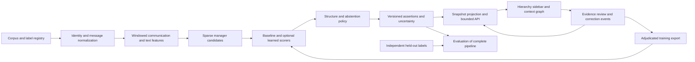

# Project 4 architecture

Build an evidence-backed, time-aware organization knowledge graph and a bounded browser explorer. The reporting chart is one projection of that graph. Preserve alternatives, unknown relationships, analyst decisions, and the evidence behind each assertion.

These are proposed design decisions, not implemented capabilities. Research date: 6 October 2026.

The [capability and completion specification](completion-spec.md) defines required end-to-end behavior, recovery rules, and acceptance scenarios. Research notes compare options; they do not add mandatory infrastructure.

## Relationship semantics

| Relationship | Meaning | Important distinction |
| --- | --- | --- |
| `reports_to` | Employee directly reports to a manager during an interval | Not merely lower rank; employee → manager |
| `member_of` | Person belongs to an organizational unit | A communication community alone does not establish membership |
| `community_member_of` | Person belongs to a computed communication group for a window | Inferred group with method/parameters; separate from a formal unit |
| `unit_part_of` | Unit belongs to another unit | Keep organizational units separate from people |
| `holds_position` | Person occupies a position during an interval | Supports acting roles, vacancies, and role changes |
| `higher_authority_than` | Evidence suggests relative authority in a specified context | Does not imply direct supervision |
| `communicates_with` | Observed communication aggregate for a window | Interaction, not formal authority |
| `influence_score` | Named network measure, window, and normalization | Analytical attribute, not an inferred reporting relationship |

Use stable person IDs with reversible alias assignments. Positions and people remain distinct when the source labels distinguish them. Represent dotted-line reporting separately from primary reporting. Several simultaneous roles may be legitimate; a single-parent display is a declared projection, not an assumption imposed on all source data. W3C ORG provides useful vocabulary for units, membership, posts, and reporting; it does not require a particular database. [Organization Ontology](https://www.w3.org/TR/vocab-org/).

## Integrated pipeline

Feedback requires an explicit training export and a new model version. An analyst edit updates the working view immediately but never silently retrains the model or rewrites its original output.

## Inference design

**Normalize before modeling.** Parse sender, To, CC, timestamps, reply chains, and message bodies. Track address aliases, mailing lists, external contacts, bots, duplicate mailbox copies, quoted replies, and forwarded material. Preserve raw evidence references while deriving cleaned features. A repeated quoted instruction must not become multiple independent observations. Missing replies can reflect an incomplete archive.

**Candidate retrieval is its own evaluated stage.** Combine direct contacts, bounded two-hop neighbors, known unit/position context where available, and explicit evidence mentions. Keep candidate origin and allow managers outside the observed population. Cap high-degree expansions deterministically and measure what was missed. A metadata-only candidate baseline permits comparisons without text access.

At N people and K candidates per person, scoring needs approximately N×K pairs rather than N². For illustration, 100,000 people × 50 candidates gives 5 million pairs. This is arithmetic, not a runtime estimate. Candidate recall sets a ceiling on downstream recovery; do not count only employees whose true manager survived retrieval.

**Start with an interpretable scorer.** Compare contact-count and centrality heuristics against logistic regression and a tree-based tabular model. Features: communication direction, reciprocity, response patterns, To/CC behavior, thread initiation, network position, temporal stability, and evidence-bearing language. Rank candidate managers; allow unresolved output. Add known-hierarchy completion as a separate experiment from communication-only inference.

**Use language models to extract attributable signals.** Supply bounded conversation excerpts and candidate identities; request relation type, direction, exact supporting spans, contradicting spans, and insufficient-evidence status. Treat model explanations as hypotheses. Check that spans exist and address the claimed people, speaker, and time. Compare a single-pass extractor with more expensive reasoning only after measuring gains. Mask identities and perform text/header/title ablations to expose memorized Enron facts and superficial shortcuts. A valid quotation still may not entail direct supervision.

**Keep GNNs conditional.** First compare identical behavioral/text features with and without message passing. A GNN should run on observed communication structure, excluding withheld label edges and their derived features. An inductive experiment must handle new people and a new corpus; an embedding tied to Enron employee IDs does not meet that requirement. See [inference research](../research/inference.md) for reproduction candidates.

**Make teams and comparison operational.** Produce formal unit/membership assertions separately from candidate communication communities. Store community method, window, membership, and stability diagnostics; stability is not proof of a formal team. For the initial comparison, compute interaction breadth and cross-unit communication counts on explicitly scoped observed traffic. Keep these descriptive measures separate from reporting inference. Review creates individual formal memberships rather than promoting every member of a cluster automatically.

**Decode structure conservatively.** For a declared primary-reporting snapshot, enforce no self-report, at most one primary manager, and no directed cycle. Keep alternate hypotheses outside the projection. Distinguish confirmed top-level role, manager outside the corpus, and unresolved manager; none should be fabricated as the CEO.

A prototype can compare greedy parent selection with a maximum-weight branching using a synthetic root to permit disconnected components. Its root edges represent unresolved assignments, not real reporting links. Explicitly translate employee→manager storage into manager→employee orientation for the decoder. Give abstention a validated utility so the algorithm cannot force a weak edge merely to connect the chart. NetworkX offers an arborescence implementation; benchmark its runtime before applying it at large scale. [API](https://networkx.org/documentation/stable/reference/algorithms/generated/networkx.algorithms.tree.branchings.maximum_spanning_arborescence.html).

Conflicting accepted edits should return a reviewable conflict. Do not silently drop one to satisfy a tree constraint. Organizational graph assertions may retain disputed or multiple reporting links even when the active primary projection cannot include them all.

## Uncertainty contract

Keep these fields separate:

| Field | Interpretation |
| --- | --- |
| `raw_score` | Model output; not necessarily a probability |
| `candidate_probability` | Nullable calibrated estimate for a candidate relation, with its calibration population |
| `selected_probability` | Optional separately calibrated estimate for the unchanged relation after a fixed selection policy |
| `calibration_scope` | Relation, corpus/population, interval, candidate/selection policy, model and calibrator versions |
| `calibration_status` | Validated in scope, unvalidated transfer, insufficient labels, or unavailable |
| `evidence_status` | Supporting, conflicting, sparse, or missing evidence |
| `review_status` | Unreviewed, accepted, rejected, disputed, or superseded |

Fit calibration on a separate split. Audit the exact selected-edge population produced by candidate generation, constraints, and abstention. If a post-selection calibrator is needed, fit it without consuming the final test set. A structural constraint does not increase empirical confidence by itself. Source-domain probabilities must be labeled unvalidated on a new corpus until target labels support validation.

Version the full selection/display policy, including thresholds and analyst constraints. A decoder, candidate, or constraint change invalidates the previous selected-edge validation claim until reassessed. User filters preserve the original cohort label; they do not confer a new guarantee on the displayed subset. Zooming or paging alone does not change the underlying model estimate.

Human acceptance is an attributed decision, not `probability=1`. A path of several uncertain edges has no justified confidence equal to their mean, minimum, or product without additional assumptions. Show edge-level states along paths and review-status counts for collapsed groups. Keep average scores out of aggregate truth claims. See [evaluation protocol](../research/data-and-evaluation.md).

## Shared data contract

Implement a versioned JSON/Parquet interchange and matching relational tables. Use opaque identifiers in exported fixtures. These records support a knowledge graph without requiring a graph database.

| Record | Minimum fields |
| --- | --- |
| Person and alias | Stable ID, display label, account aliases, alias evidence, validity, merge/split history |
| Unit or candidate group | Stable ID, kind, label/source, interval/window, membership assertion IDs; computed groups also carry method/parameters/run |
| Message reference | Corpus ID, message ID, content hash, timestamp, thread ID, source locator, access classification |
| Evidence | Kind (`message_span`, `communication_aggregate`, `source_assertion`, `analyst_reference`), source/version, applicable time, identity mapping, support/contradiction role; kind-specific offsets or reproducible derivation |
| Assertion | ID, subject, relation, object, origin (`source`, `model`, `analyst`), valid interval, time precision, evidence IDs, model run where applicable, score/calibration fields, review status |
| Model run | Input/split hashes, feature and candidate policies, model/prompt versions, seeds, parameters, costs |
| Job | ID, input/configuration bindings, state, checkpoint, record counts, errors, output references; snapshot publication only after validation |
| Review event | Event ID, assertion ID plus semantic relationship target, previous/proposed value, interval/scope, reason, evidence, actor reference, recorded time, base revision |
| Snapshot | Corpus/import revision, identity revision, inference run ID, model/calibrator versions, effective time/window, review revision, projection/filter policy version, creation time |

Track both **when a relationship held** and **when the system learned it**. An archival hierarchy with no precise validity dates must retain uncertain temporal scope. Do not manufacture monthly labels from it.

For an “as of” view, classify assertions as definitely valid, possibly valid, or excluded. Unknown-date assertions appear in a visibly separate possible-history layer, disabled in the default dated primary projection. They do not create hard temporal conflicts until adjudicated. Preserve them for discovery; display the omission count.

Provenance should link data, transformation, and responsible actor. These concepts align with W3C PROV; full RDF serialization is optional. Raw messages stay in their controlled store, while the graph carries resolvable references. [PROV-O](https://www.w3.org/TR/prov-o/).

Message offsets apply only to text spans. Metadata-only predictions cite versioned aggregate derivations and covered sources; never invent a supporting quotation. Evidence loss changes availability and freshness, not automatically the relationship's truth or review decision. Mark affected explanations unavailable/stale and rerun affected inference when inputs change.

## Browser and storage

Recommended prototype: Python batch pipeline, FastAPI service, SQLite for entities/assertions/reviews, and React with TypeScript. Persist larger feature tables as Parquet when useful. Select the context renderer through the short comparison in [exploration research](../research/exploration.md). These are provisional choices to keep one local deployable system; pin versions after the spike.

The left sidebar provides search, a virtualized hierarchy, ancestor breadcrumbs, and filters. The center shows a bounded neighborhood or collapsed units. The detail pane provides alternate managers, dated evidence, review actions, and confidence scope. Maintain the selected person and camera context during expansion. Provide keyboard navigation and a tabular relationship view.

Level of detail changes information, not just size: organization/unit summaries → team groups → people → selected evidence. Unassigned people remain searchable. Hypothesized communities are visibly marked and separate from formal units. Toggle communication and influence overlays explicitly; keep them off by default in the reporting chart.

Proposed API operations:

| Operation | Required behavior |
| --- | --- |
| Search people and units | Server-side ranking, cursor pagination, snapshot ID |
| Fetch ancestors or children | Depth/result limits, snapshot-bound cursor, stable sibling order, absolute positions, scoped totals, relation semantics |
| Fetch context graph | Enforced node/edge budget; disclose collapsed, filtered, and omitted items |
| Fetch groups or communication comparison | Group kind, metric definition, window, population, source coverage, bounded results |
| Compare snapshots | Identity-aware semantic changes; distinguish relationship, score, review, evidence, and policy changes |
| Fetch evidence | Authorize source access; return evidence bound to the assertion version |
| Submit correction | Idempotency key, base-revision check, temporal/cycle validation, append event, return changed revision |
| Inspect or cancel job | Progress, counts, recoverable errors, checkpoint; cancellation preserves last completed snapshot |
| Export graph or labels | Frozen snapshot and provenance; include inferred/reviewed distinctions |

The browser must not download the entire million-node graph and merely hide most of it. Cache bounded neighborhoods and use workers for expensive layout work. Precompute hierarchy indexes and group summaries server-side. Avoid a complete ancestor closure for pathological deep trees; use bounded traversals and an index strategy tested against the actual topology.

Bind every page/cursor to an immutable snapshot and sort key; reject cross-revision continuation rather than duplicating or skipping entries. Search returns a bounded path-expansion plan to the selected entity. If a correction/filter removes its parent, retain focus on the entity through a disclosed detached-context view, or move to the nearest visible ancestor with an accessible announcement.

Start with local, single-analyst operation. Move to PostgreSQL when concurrent editing, deployment, or measured query needs justify it; evaluate a graph database only when traversal workloads justify another service. Changing databases cannot solve visual clutter by itself.

Persist local job records and publish snapshots atomically after validation. Interrupted jobs leave the last completed snapshot active; retry reuses compatible checkpoints without duplicate output. Partial diagnostic results remain separate from completed graph views. Store original outputs for reproducibility; rerunning a stochastic model may produce a different recorded attempt.

## Analyst corrections and feedback

Support accept/reject edge, choose alternate manager, add missing person/unit, edit labels/roles, set a validity interval, and undo by compensating event. Identity merge/split requires a preview of affected assertions. Reject stale revisions; preserve both proposals for reconciliation. Validate time-specific constraints, not just the graph across all history.

Review decisions bind to subject, relation, object, reporting type, and effective scope, as well as the original assertion ID. A new model assertion ID cannot bypass a rejection. Within scope, an accepted human replacement takes precedence in the working projection; contradictions remain reviewable. Rejection alone leaves the manager unresolved and presents alternatives for review, rather than automatically accepting the next candidate. Identity merges/splits flag affected decisions for reconciliation instead of silently retargeting them.

Accepting an unchanged model assertion preserves its model probabilities. Changing manager, relation, identity, or interval creates a new human assertion with model probabilities set to null; the prior prediction and scores remain in history. Only a new compatible model/calibration run can supply an estimate for the changed claim.

Retraining uses an adjudicated export with provenance, sampling policy, and split membership. Keep independently sampled evaluation cases outside the review queue. An uncertainty-selected correction set is useful for learning but biased for estimating general accuracy; active testing research explicitly addresses this distinction. [Kossen et al. 2021](https://proceedings.mlr.press/v139/kossen21a.html).

Public demos use synthetic people and messages unless redistribution terms explicitly permit the selected real materials. Keep model access to communication content within the corpus permissions. Display retrieved email as untrusted text; it must not execute markup or become instructions to the evidence extractor.
