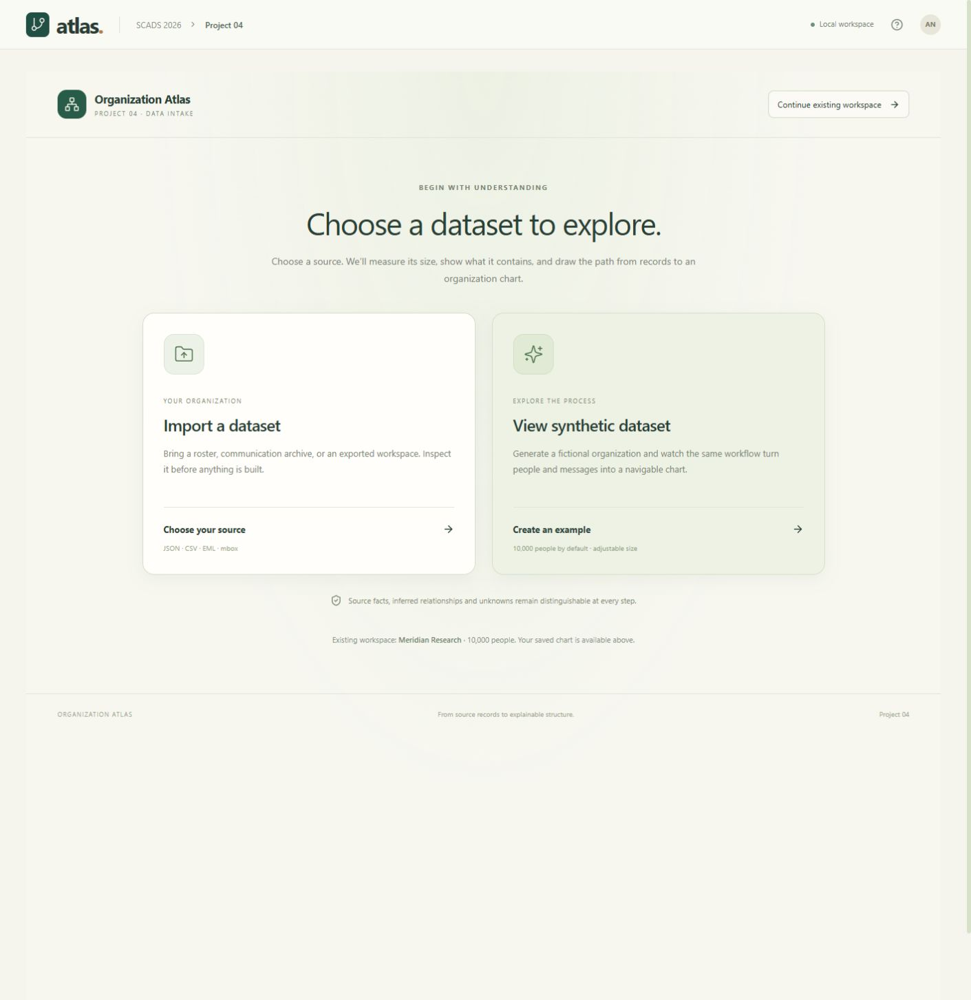
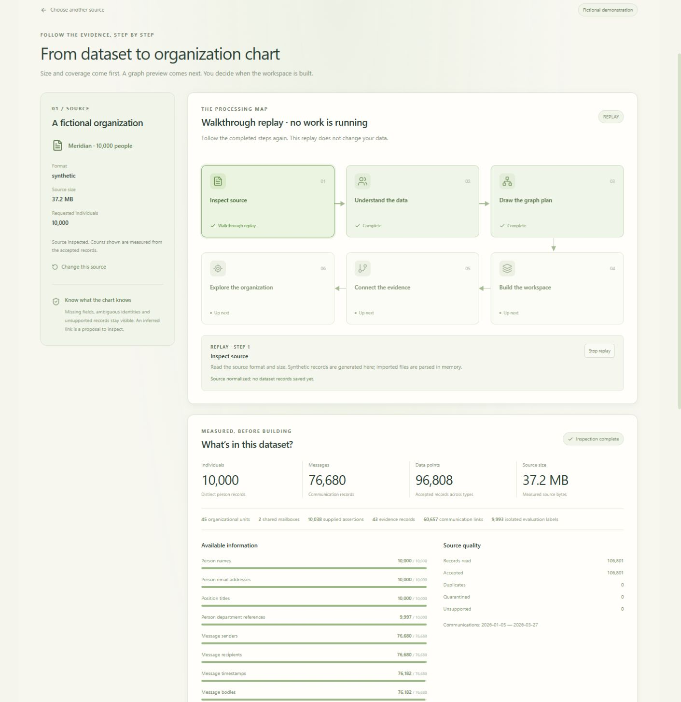
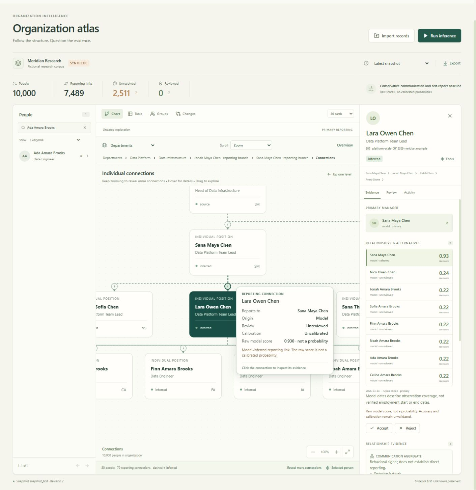
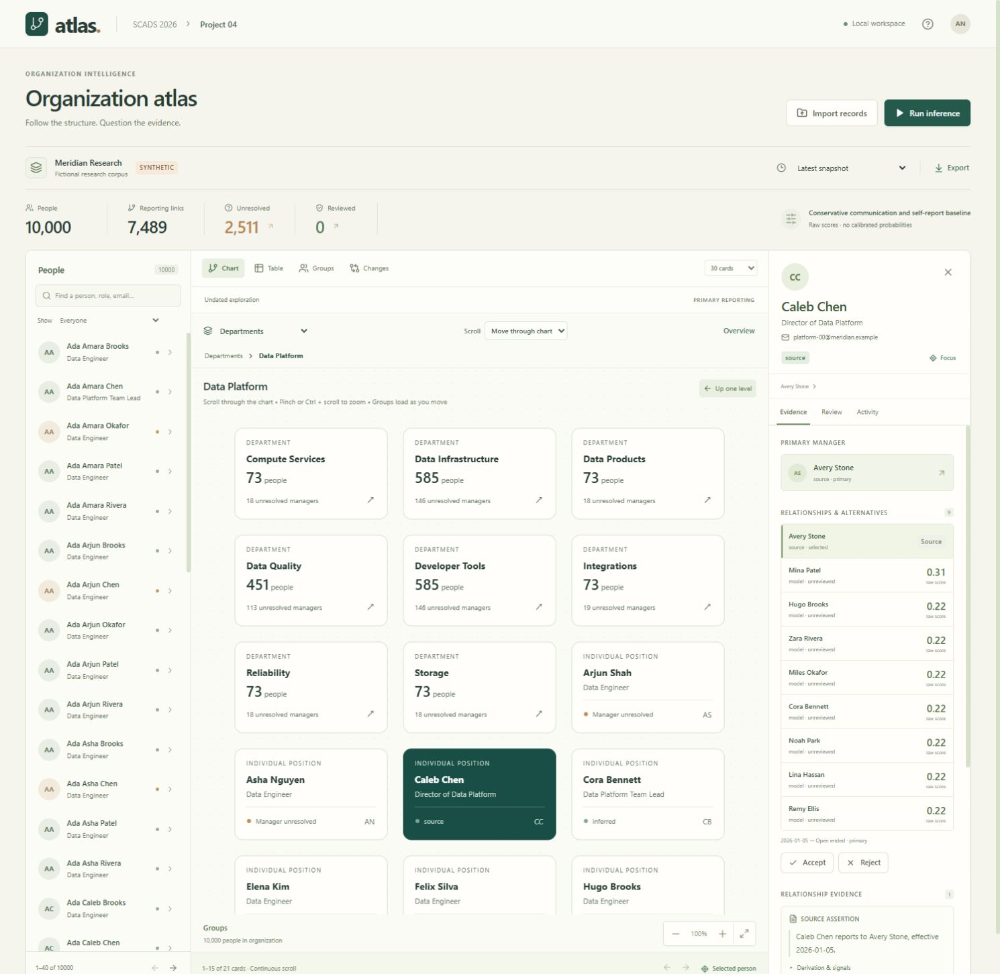
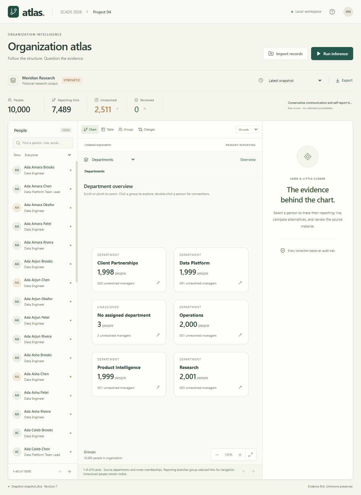
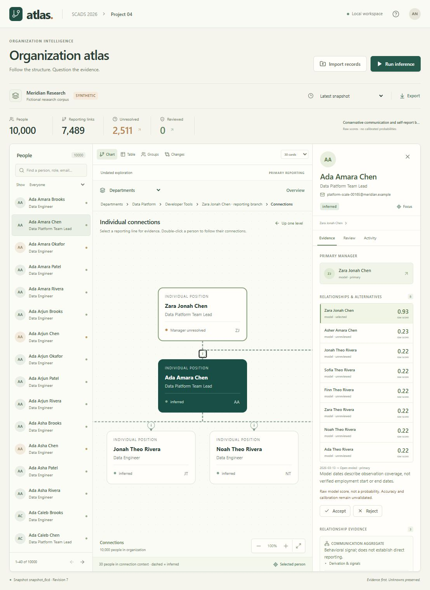
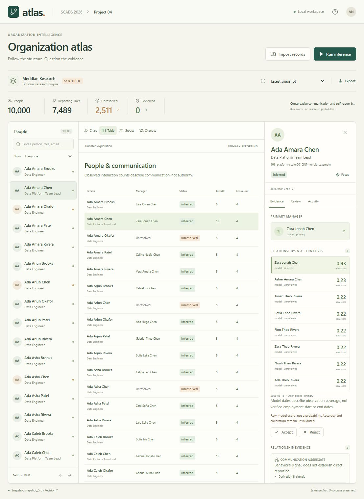
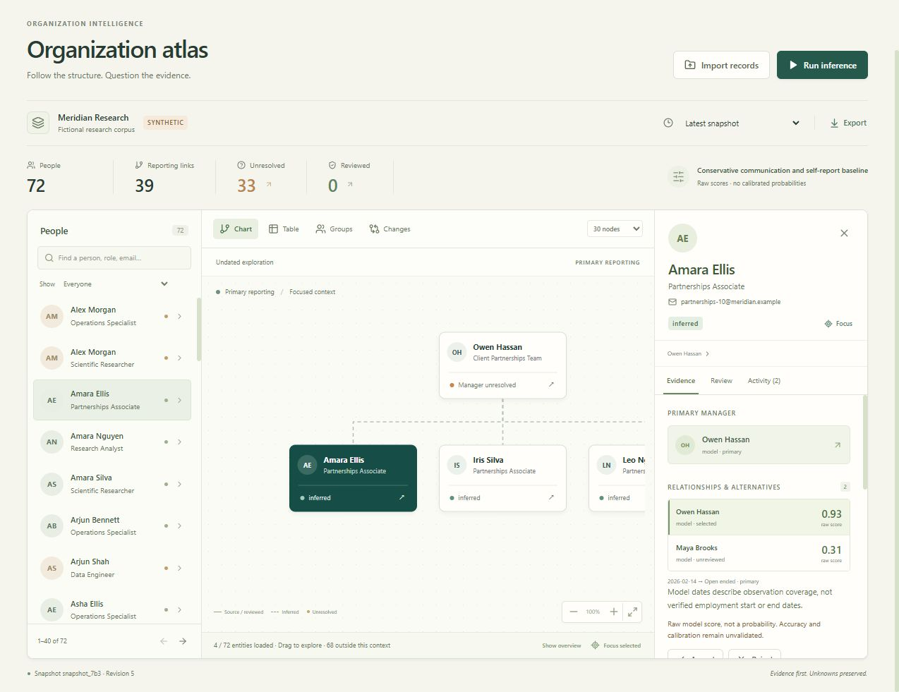

# Build verification

## Guided dataset intake

The initial page offers **Import a dataset** or **View synthetic dataset**, plus continuation of an existing workspace. Both routes display the six-stage processing diagram before preparation. Source inspection, inventory and a bounded source graph preview run in memory; records are saved only after the review checkpoint. The application may already have an empty SQLite schema or a saved workspace. The guarantee concerns dataset records, not the existence of a database file.

**144 Python tests passed in 47.25 seconds**, with one existing non-failing Starlette deprecation warning. **99 frontend tests and the production build passed.** The 23 new intake checks cover record immutability during profiling, inventory, excluded evaluation labels, bounded previews, revision/replacement guards, saved-chart reuse, failed-inference retry, cancellation/capacity/expiry, package history validation and concurrent-corpus protection. Frontend checks cover first-entry choices, stage truth/replay phases, source sizes, coverage and preview provenance/closure. Later sections preserve earlier milestones.

Browser checks:

- The initial choice and complete processing map appear before generation/upload inspection. Synthetic defaults to 10,000 people; imported file size appears immediately after file selection.
- The 10,000-person preview measured **76,680 messages, 96,808 data points, 45 units, 2 shared mailboxes, 60,657 directed communication links and 37.2 MiB of canonical source**. Evaluation labels are separate. Field coverage explicitly reveals absent bodies/timestamps. Source relations and imported model proposals retain their origins.
- Live preflight and reuse preserved revision **7**, **2 imports, 7 snapshots, 2 reviews and 3 durable jobs**. The existing chart opened with 10,000 people and 7,489 selected reporting links; inference was honestly marked unnecessary.
- A separate empty workspace accepted `fixtures/sample-communications.csv`: **3 people, 4 messages, 7 data points**, one duplicate and one quarantined record. The database still had zero imports/snapshots/jobs at the review checkpoint. Build then produced a three-person chart with one selected reporting link.
- An isolated switch to the 72-person synthetic fixture required explicit replacement. It completed with 39 selected links; previous imported records/history remained stored.
- Build smoothly returns the viewport to the processing diagram; completion exposes the Explore button there. At a 390-pixel viewport, document scroll/client widths both measured 384 pixels, with sequential stages and no page overflow. The viewport override was reset afterward.
- Final-build import verification observed the automatic replay start at completed step 4, with Explore already available. Abandoning a prepared synthetic preview released it and reopened fresh three-person CSV workspace metadata. Both tested browser tabs reported no console warnings/errors.

Highlights follow actual server stages. Fast completed phases have an automatic, clearly labeled **walkthrough replay**; manual replay is also available. Replay never delays processing or writes data. Reduced-motion CSS disables decorative animation, and scrolling uses the same preference. No browser frame-rate or full accessibility claim is made.

Prepared inputs are memory-only, limited to two retained jobs and one active worker, with a 30-minute idle expiry. Reload/server restart does not resume the intake screen. Once import has started, failed inference can leave the source saved for retry; the UI does not promise rollback. Large archives still require memory and fixed adapters; arbitrary field mapping, streaming ingestion and real-data inference validation remain open.

## Progressive connections and hover information

**85 frontend tests and production build pass.** Backend and corpus unchanged; the prior full Python run passed 121 tests. New tests cover bounded connection expansion, stable retained positions, collision-free added cards, newly revealed ancestors, local component exhaustion, truthful tooltip metadata, constrained positioning and the default Zoom selection.

Continued wheel zoom expands a focused reporting context from 30 to 80 to 200 people. Existing card positions stay fixed and only nearby cards render. At the context limit, zooming over another person follows their reporting neighborhood. A **Reveal more connections** button provides the same expansion. Short/exhausted components stop without inventing links; organization-wide omitted counts are not treated as undisplayed local connections. Expanded context, layout and camera survive return navigation; selecting the already-focused person recenters without discarding expansion. Snapshot/request guards reject stale expansion results.

Hovering or keyboard-focusing a department, group, person or reporting marker shows its available details. Person information includes role, manager, direct reports, status and email where present. Reporting tooltips retain source/model origin, review state and calibration status; raw scores are labeled **not a probability**. Escape dismisses the tooltip without leaving the hierarchy. Wheel **Zoom** is the default; optional continuous pan remains available.

Live browser checks: Ada Amara Brooks' context expanded from **29 to 79 to 199 reporting links** using successive wheel gestures. The focused card retained its exact world position. Recenter preserved the 200-person context; Up and Selected person restored the expanded graph and exact camera. Further wheel zoom over Lara Owen Chen followed her neighborhood, and explicit expansion loaded 79 links there. Department/person/edge mouse-over content, keyboard description linkage, Escape dismissal and default Zoom were checked. No console warnings/errors observed; revision remained 7. These checks do not establish a frame-rate benchmark or physical touch-device qualification.

## Smooth zoom and continuous scrolling

**66 frontend tests pass; TypeScript and production build pass.** Backend/data unchanged; the preceding full Python run passed 121 tests. Added checks cover frame-rate-independent camera easing, cursor anchoring, reduced motion, wheel units/modifiers, cache deduplication/cancellation, bounded forward/backward windows through 10,000 cards, and responsive grid anchoring.

The camera updates the SVG viewBox per animation frame, while React receives throttled positions for culling/loading. Old scenes remain visible until a new scope arrives. The browser retains at most 240 cards of active metadata and renders at most 200 nearby cards; an additional 24-response cache supports quick return navigation. Pages use absolute positions, so loading another batch does not refit or shift existing cards. These bounds are implementation limits, not a measured frame-rate guarantee.

**Scroll → Move through chart** provides continuous panning and automatic loading. Ctrl + scroll/pinch zooms in either mode; Shift + scroll moves sideways. The default **Zoom** mode retains scroll-to-drill behavior. Back/up navigation restores the previous neighborhood; reduced-motion preferences suppress easing and scene animation.

Live browser checks on the existing 10,000-person workspace:

- Scrolled through all 63 top-level inferred-group cards across the initial 30-card batch, reached 49–63, then reversed to 1–15 without page buttons.
- Entered Communication group 60 from the bottom and returned. Settled SVG viewBox matched exactly before/after (`-65.5 2623.796875 863 752.203125`); 21 nearby cards rendered.
- Resized to 1100×900 at that position: two-column layout preserved the same neighborhood. Resetting the viewport restored the original three-column view and exact camera.
- Wheel zoom entered Data Platform; double-click opened Caleb Chen's individual connections; the Avery Stone → Caleb Chen evidence marker displayed its source assertion. Up navigation restored Data Platform.
- No browser console errors or warnings observed. Workspace remained revision 7; corpus and history unchanged.

Physical touch devices, screen-reader qualification, network-latency stress and formal browser frame-time measurements remain unverified. The sections below preserve earlier verification milestones.

## Semantic chart zoom

Current checks: **121 Python tests passed** in 39.43 seconds (one existing Starlette warning); **21 frontend tests passed**; TypeScript and production build succeeded. Added checks cover nested membership rollups, orphan/unresolved coverage, full inferred memberships beyond 200, stable paging, person lookup, source dates, snapshot isolation, edge provenance, malformed unit cycles, pointer-centered zoom, zoom thresholds, initial rendering and readable focus ancestry.

Read-only traversal of the live 10,000-person snapshot reached every person through both groupings: 476 formal scopes / 501 bounded pages; 1,077 inferred scopes / 1,082 pages. Every emitted edge referred to displayed people. Root formal response contains five divisions plus an explicit three-person unassigned bucket; its payload measured 1,216 bytes. The chart uses metadata only, with at most 200 visible cards and two cached snapshot indexes. These are coverage checks, not browser frame-rate guarantees.

Browser checks exercised wheel zoom into Data Platform, nested Data Infrastructure and reporting branches, individual positions/connections, +/− transitions in both directions, inferred-group paging/drill-down, and directory-to-person focus. Reporting ancestors align above the focused position; individual edge markers open evidence. Department membership, inferred community membership and reporting branches are labeled separately. Unresolved managers remain visible.

Wheel, buttons and keyboard controls were exercised on the desktop browser. Touch pinch is implemented but physical touch-device verification remains open. The later smoothing update fits a nearby window for long scopes; normal navigation starts at readable card size. A full accessibility audit and frame-time benchmark remain future work.

## 10,000-person expansion

The persisted local workspace now contains **10,000 people, 45 formal units, two shared mailboxes, and 76,680 messages**. Full Python suite: **114 passed in 29.51 seconds**, with the same non-failing Starlette warning. Tests cover deterministic generation, unique identities/reference closure, label isolation, inference behavior, explicit corpus replacement, stale revision rejection, preserved snapshots, and retry after a failed demo inference.

The actual corpus generated in 0.711 seconds, imported in 9.199 seconds, and completed inference/publication in 46.979 seconds. Revision 7 contains 7,489 selected reporting links and 2,511 unresolved people, with 107 groups (45 formal and 62 inferred). All model scores remain uncalibrated. These are one local run's timings, not isolated performance or inference-quality measurements. [Raw results and corpus fingerprint](synthetic-10000-results.json).

Original 72-person snapshots remain readable; a canonical backup was saved before switching. First, middle and last 50-person pages returned the expected population and counts. A focused graph on the last page respected the 200-node budget. Browser checks verified the 10,000-person summary, paging, generated-person search, focused hierarchy and message evidence. The generated input is `runs/synthetic-10000/corpus.json`; its authored labels are also saved separately in `runs/synthetic-10000/ground-truth.json`. Reproduction commands are in the [README](../README.md#10000-person-synthetic-corpus).

The remaining sections record the earlier 72-person build. The expanded fixture tests software behavior and workload size; shared templates and authored labels cannot establish real-data accuracy or calibration.

Verified October 6, 2026 (Pacific), on Windows 11 ARM64, Python 3.12.14 and Node 24.18.0. Fictional records only.

## Executable checks

- **95 Python tests pass:** 15 parser, 35 inference/calibration, 15 store, 16 API, 14 temporal review. The full 92-test suite passed; after three added store regressions, all 45 affected store/API/temporal tests passed again.
- **4 frontend layout tests pass.** TypeScript and final production build pass. npm audit reported zero vulnerabilities in the installed dependency set.
- One non-failing test warning: Starlette deprecates its current httpx TestClient backend.
- PowerShell setup/start scripts parse successfully. Dependency installation, frontend compilation, CLI/server startup were exercised locally; a clean-device installation remains unverified.

## Browser checks

The real API-backed browser successfully loaded the demo, searched people, selected a person with Enter, displayed exact evidence spans and alternatives, rejected an assertion with a reason, undid the review, retained both history events, reran inference, and compared snapshots. The identical rerun correctly showed zero relationship changes. Formal units and inferred groups remained separately labeled.

Canonical export produced a downloaded JSON file. Restoring that actual download into a separate database recovered 72 people, 39 selected primary links, five snapshots and revision 5. Export/restore API and store tests additionally compare historical projections and evidence.

The chart initially fit a wide forest into unreadable cards. The final build starts at readable card size, packs separate trees, includes the focused person's parent, and provides pan/zoom/explicit fit. A narrow 390-pixel viewport was inspected; directory scrolling and stacked layout work. Toolbar wrapping fixed the observed page overflow; final selected-person page measured equal scroll/client width (384 pixels with scrollbar). This is a desktop-first workbench; full mobile/accessibility acceptance remains open. No errors were observed in browser console logs during the final workflow. Browser download event instrumentation timed out, but the resulting file and its restoration were verified directly.

## Scale checks

[Reproducible benchmark](../scripts/benchmark.py), [complete results and environment](benchmark-results.json).

| Synthetic profile | Import | List page p95 | Substring search p95 | Focus graph p95 |
| --- | ---: | ---: | ---: | ---: |
| 10,000 mixed | 2.75 s | 27 ms | 45 ms | 41 ms |
| 100,000 mixed | 77.95 s | 120 ms | 755 ms | 43 ms |
| 10,000 wide | 2.27 s | 53 ms | 48 ms | 69 ms |
| 1,000 deep | 0.86 s | 223 ms | 5 ms | 158 ms |

All bounded graph, edge closure, selected-page, complete root-sibling and snapshot consistency checks passed. Deep ancestry explicitly reports truncation. Seven warm reads per operation; timings are descriptive, variable and include concurrent local development activity. The slower deep-case outlier illustrates the lack of an isolated benchmark environment.

These are Python/SQLite measurements on source-only hierarchies. They exclude HTTP, browser rendering, dense communications and model quality. The intended full latency/scale targets are not established.

## Remaining gates

See [C01–C17 acceptance](acceptance.md): identity merge/split, membership adjudication, richer import mapping, full keyboard/screen-reader testing, clean-device reproduction and browser-scale measurements remain. Real labeled source and transfer corpora are still needed for model training, manager accuracy, calibrated probabilities and analyst evaluation.
