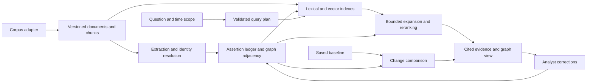

# GraphRAG system design

Target architecture. The executable backend is SQLite with authored/local-model assertions, exact dense/hybrid retrieval, and a local browser workspace; see [implementation status](implementation-status.md). PostgreSQL, ANN, richer identity/review, and measured scale remain planned.

The proposed system stores source-backed relationship assertions, selects them by relevance and time, and presents a small explorable graph alongside the evidence. Start with one database and bounded jobs; add infrastructure only when measurements identify a bottleneck. The [build specification](../BUILD_SPEC.md) owns release scope and priorities; [contracts](contracts.md) own records and operation semantics.

## Components

**First deployment:** Python modules and worker commands, PostgreSQL + pgvector, a file store, then a thin browser client. No mandatory graph server, distributed scheduler, or vector service. Database job records support batching, retries, checkpoints, and resumable failures. Store model configuration and usage per job; pin dependencies when building.

PostgreSQL provides lexical ranking via `ts_rank`/`ts_rank_cd`; call this the lexical baseline, not BM25. pgvector supplies exact and approximate vector search. Exact filtered search establishes the retrieval reference before introducing approximation. [PostgreSQL text search](https://www.postgresql.org/docs/current/textsearch-controls.html), [pgvector](https://github.com/pgvector/pgvector).

## Minimal graph schema

| Record | Required content |
| --- | --- |
| Document version | Corpus/document/version IDs, raw hash, processing version, normalized text/hash, source locator, availability and ingestion times |
| Chunk | Source/processing version IDs, exact text offsets, chunker version, optional page/section mapping |
| Mention and identity | Source mention spans, candidate entity IDs, resolution status; versioned merge/split decisions |
| Assertion occurrence | Stable source/processing/span occurrence ID, endpoint mentions, relationship wording, qualifiers, modality/negation |
| Assertion interpretation | Immutable version of resolved endpoints, temporal interpretation, review status, and extraction/provenance lineage |
| Projected edge | Snapshot-specific grouping of compatible interpretations; references every contributing occurrence and conflict |
| Assertion event | Record, supersession, withdrawal, correction, identity decision, or analyst annotation; actor and recorded time |
| Embedding | Object ID and revision, exact embedded-text hash, model/version/dimension |
| Snapshot | Eligible document/assertion versions, extraction/resolution/index versions, knowledge boundary, build status |
| Baseline | Snapshot, query/scope, temporal mode, included findings, review state, retrieval configuration |
| Query run | Effective plan, frozen ordered results, findings/citations, versions, budgets, coverage, answer, stop reason |
| Investigation | Question, entity anchors, notes, selected findings, run/baseline references, view state, optimistic write version |

Relationships remain prose, but identity, provenance, timestamps, and status need structure. Retain unresolved mentions instead of merging names automatically. Preserve multiple source assertions for the same apparent relationship; deduplication must not erase disagreement or treat copied reports as independent support.

Keep n-ary context such as project, role, amount, location, or condition in qualifiers and the source span. Introduce an event node only where the relation cannot be represented without losing meaning. Embeddings index assertions; they do not establish equivalence, truth, or calibrated confidence.

Do not deduplicate free-text relationships by endpoint pair alone. Two entities can have several simultaneous roles or incompatible claims. Source revision links and reviewed equivalence mappings establish lineage; text similarity only generates bounded match candidates. Changed chunk boundaries require source-span reconciliation, with unresolved matches retained rather than counted automatically as new facts.

## Ingestion and updates

1. Preflight a bounded sample and capability manifest; validate adapter records, lifecycle-event identity, timestamp meaning, hashes, and revision relationships.
2. Preserve originals; normalize with offset mapping; chunk deterministically. Deduplicate exact content while preserving each source occurrence.
3. Extract mentions and relationship assertions with cited spans. Validate offsets, endpoint grounding, direction, negation, and temporal claims. Quarantine malformed results; allow abstention.
4. Resolve identities using explicit identifiers and contextual candidates. Keep ambiguous matches separate. Cache only against the full extraction input, including source date/timezone, language/context, processing profile, and supplied identity map as well as content/prompt/model/schema.
5. Embed eligible chunks and assertion text. Include endpoint labels and qualifiers from that version, never a future entity summary.
6. Publish an immutable snapshot after its declared capability profile completes. Source-only generations need no assertion extraction; graph generations report completed/empty/abstained/excluded units. Queries pin one compatible snapshot; incomplete required stages remain unavailable.

Updating a document schedules only changed chunks and dependent assertions initially. Identity changes may fan out to many assertions; record that cost. Summaries, embeddings, and caches carry dependency IDs and become dirty when those inputs change. Rebuild or omit dirty artifacts; never serve them silently. Retractions remove assertions from current views while retaining allowed history. Source withdrawal and factual retraction are distinct events.

Use staged rows/index generations with `prepared_at`, invisible to queries. Atomic activation assigns query-facing ledger `recorded_at`/sequence, publishes membership/capability watermarks, and advances the active pointer. Record original durable source receipt as `ingested_at`; neither staging time nor receipt alone makes an extracted claim available. Retries inspect activation state before spending or publishing again.

Source/processing membership has its own first-activation `visible_from/visible_seq`; lexical and direct-evidence reads enforce it even without claims. Receipt before K with first activation after K remains unavailable in strict system-history mode.

Keep manifests lightweight: immutable version membership and generation references, not a full copy of every file/vector per snapshot. Reuse unchanged stored artifacts. Pin baseline dependencies and saved runs; keep historical index artifacts only under an explicit retention policy. Missing artifacts disable literal replay, not correctly labeled reconstruction from retained evidence.

## Query execution

1. Validate corpus, snapshot, knowledge cutoff, optional event-time constraint, mode, and budget. Ask for clarification only when the time interpretation changes the answer.
2. Search eligible chunk text, assertion text, and entity mentions. Fuse ranked lexical/dense lists using a documented method; do not add incompatible raw scores.
3. Expand adjacent assertions from selected identities, with deduplication, per-node caps, a global edge cap, and a hop limit. Apply eligibility at every hop.
4. Rerank a bounded set. Retrieve supporting source passages, including conflicting evidence. Diversify by source lineage and evidence coverage.
5. Produce findings with assertion IDs, source spans, temporal qualifications, and unresolved conflicts. The model may decline to infer a relationship.
6. Return the evidence graph, cost/latency trace, and any truncation or stale-index limitations. Graph paths establish connections in the evidence, not causation.

Persist the validated plan and ordered result IDs before pagination or baseline creation. “Why shown” identifies lexical/dense selection or an expansion predecessor plus active filters. Deterministic tie-breaking uses score/rank then stable ID. Any model-generated plan passes the same allowlisted validation as a structured CLI request.

Proposed interactive defaults: up to 100 hits per retrieval channel; 300 deduplicated seeds; two expansion hops; 500 expanded assertions; 50 reranked passages; 12,000 evidence tokens; one synthesis call. Enforce separate token, scan, wall-time, and model-call limits. These are tuning knobs, not performance promises. On exhaustion return partial evidence with the bound reached.

Track budget cumulatively per logical run, including expansion pages, retries, and comparison subcalls. Count explicit visited edges/candidates before expansion; native database scans may lack an exact interruptible count, so use statement/request deadlines and report the scan counter's quality. `LIMIT` bounds output, not work. A cancelled statement can return no partial rows; preserve only completed-stage evidence. Provider calls reserve token/call budget before dispatch.

Start with local and baseline-change queries. Add broad corpus synthesis only after evaluation identifies a need. Global claims require coverage accounting; a bounded local search cannot claim to enumerate every change or theme in the corpus. If adding community summaries, version them by snapshot and disclose coverage/staleness.

## Temporal search correctness

The [temporal workflow](temporal-workflow.md) defines event time versus knowledge time and the two-snapshot comparison. Strict system-history replay requires eligible source versions, assertion events, identities, lexical statistics, and derived artifacts. An unchanged model does not make an index built from future evidence safe for historical replay.

Apply time/scope predicates inside every retrieval query. pgvector approximate indexes can scan candidates before filtering, reducing result count and recall; iterative scans help but are bounded. Compare to exact search under identical filters, and use exact search for small eligible sets. `strict_order` sorts retrieved results; it does not make approximate retrieval exhaustive. [pgvector filtering](https://github.com/pgvector/pgvector#filtering).

Do not compute a change report by subtracting two top-k result lists. Knowledge/source comparisons combine ledger events with explicit reconciliation of saved findings or the baseline/target neighborhood union. World-state comparisons instead inspect eligible event/validity boundaries and state projections at fixed knowledge time. Retrieve paired source evidence after candidate matching. Where only a bounded subset is examined, label the report as ranked change candidates. Absence from retrieval is not evidence of absence.

Comparison has its own scan/model/time budgets and resumable cursor. Literal historical replay requires the saved index/configuration; reconstructing an old knowledge state from eligible versions is labeled separately. Scheduled events retain planned modality even after their proposed date passes.

Run change matching in order: immutable occurrence/interpretation identity; explicit supersession/review links; versioned identity-equivalence mappings; bounded semantic candidates checked for endpoints, qualifiers, modality, and time. Preserve uncertain alignment as `unresolved_match`. Processing/identity changes have their own categories and never alone imply a world transition.

World-state comparison evaluates both valid times from one analysis snapshot at fixed K; baseline scope is reused without mixing in its older knowledge watermark. Knowledge comparison preserves both snapshot boundaries. Pagination carries these distinct parameters explicitly.

## Scale and cost controls

Measure documents, versions, tokens, chunks, entities, assertions, vectors, and degree distribution separately. The main risks are extraction cost, duplicate evidence, identity-resolution fanout, highly connected nodes, filtered-search recall, and summary invalidation.

Raw float32 vector bytes are approximately `4 * dimension * vector_count`. Example assumption: one million chunk vectors plus five million assertion vectors, dimension 768, require 18.432 GB decimal for vector values alone. Text, historical versions, indexes, metadata, and runtime memory add overhead. Measure the actual assertion/chunk ratio before planning hardware.

Record initial processing cost, per-update cost, and per-query cost. Compare `build + updates + query_count * mean_query_cost` over a stated workload; moving work into ingestion or deferred extraction does not remove it. Report actual model tokens/calls and local compute alongside any currency conversion.

Benchmark exact search, filtered HNSW, reduced dimensions/precision, and partitioning in that order as needed. If the chosen backend cannot meet the measured recall/latency target, evaluate a filtered vector engine behind the same contract. Qdrant documents payload-aware HNSW and strict-filter complications; that makes it a candidate, not a presumed winner. [Qdrant indexing](https://qdrant.tech/documentation/manage-data/indexing/).

## Analyst interface

- **Query and scope:** question, snapshot, knowledge/event-time selectors, saved baseline.
- **Findings:** cited statements, change categories, contradictory evidence, missing-time warnings.
- **Graph neighborhood:** initially at most 100 nodes/200 edges; expand on demand; indicate omitted counts where known. Preserve selected positions during updates.
- **Evidence panel:** exact source version and passage; original phrasing; extraction/review status; temporal basis.
- **Timeline and comparison:** separate effective dates from learned dates; pair old/new evidence; show late arrivals and corrections explicitly.
- **Review actions:** annotate, dispute an assertion, propose an identity merge/split, save a baseline; use version checks and reversible ledger events.
- **Investigation and export:** reopen saved runs/baselines, keep notes separate from evidence, and export selected findings with paired citations and coverage.

Persist layout separately from evidence. Selecting or hiding an edge changes the view, not its factual status. Display extraction scores as scores unless calibration has been established. Select a renderer during the UI milestone using bounded-view measurements.

Annotations/proposals enter a review overlay; effective corrections use an explicit apply action and a new published generation. A local disambiguation choice affects only that query; it is not a canonical entity merge. Detailed transitions, empty/partial/conflict states, and the first demonstration are in [analyst workflows](analyst-workflows.md).

## Integration boundaries

Keep ingest, extract, search, compare, and review as callable core operations. CLI, MCP, and HTTP wrappers share the same validation and result envelope. Structured model output is validated data; the model does not execute unrestricted SQL or invent tool parameters.

Treat corpus text, retrieved passages, and model outputs as untrusted data throughout parsing and synthesis. They cannot change scope, invoke external actions, or apply reviews. Keep deterministic model stubs available for fixture tests; report model-backed and stubbed results separately. Instrument job stage, dependency versions, calls/tokens, retries, latency, and stop reason without placing raw evidence in generic operational logs.

Other projects can later supply source records or consume cited assertions. Do not assume Project 4 identity/uncertainty semantics or Project 3 metadata-only release rules match this project. Add explicit adapters and preserve provenance. The website is a client of the eventual service; a static showcase can use exported, clearly labeled demonstration snapshots.
